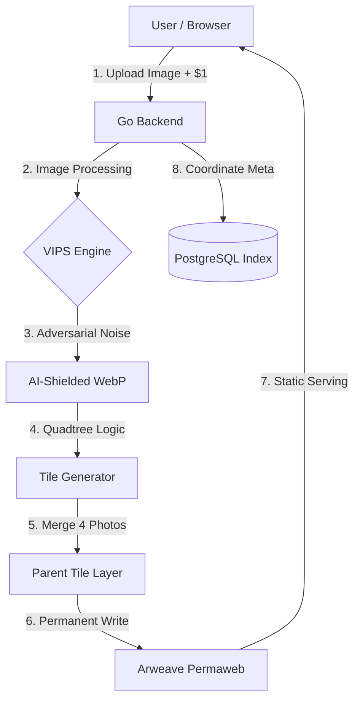

# PRD: Humanity Galaxy (2026 Edition)

## 1. Executive Summary

**Humanity Galaxy** is a perpetual digital archive.

It provides a **3D, infinite, antigravity environment** where users pay a **one-time fee of $1** to upload a photo.

Using a **Quadtree Image Pyramid**, the system scales toward a **Decillion (10³³) image capacity** while maintaining extreme cost efficiency and built-in resistance to AI scraping and training.

---

## 2. System Architecture & Data Flow



---

## 3. Technology Stack (The “Decades” Choice)

| Layer | Technology | Reason for Choice |
|------|-----------|------------------|
| Frontend | Three.js + WebGPU | Highest performance for 3D; 2026 industry standard |
| Backend | Golang | Extremely stable, low memory, maintainable for 20+ years |
| Image Proc | libvips | ~10x faster than ImageMagick |
| Storage | Arweave | Pay-once-store-forever (200-year guarantee) |
| Database | PostgreSQL | Proven, durable coordinate indexing |
| API | Fetch & XHR | Upload progress + streaming |

---

## 4. Key Algorithms

### 4.1 Quadtree Image Pyramid

- Level 0: Single 256×256 tile
- Level N: Each tile splits into 4 children

```
Tile(z, x, y) = Merge(Child[0..3])
```

Path:
```
/tiles/{z}/{x}/{y}.webp
```

---

### 4.2 Antigravity Physics

```javascript
position.x += Math.sin(time + noiseOffset) * 0.01;
position.y += Math.cos(time + noiseOffset) * 0.01;
position.z += Math.perlin(position.x, position.y) * 0.005;
```

---

### 4.3 9-Pixel Shader Abstraction

- LOD 2: 3×3 pixelation
- LOD 1: Gaussian blur
- LOD 0: Full texture

---

## 5. Sustainability & Cost Model

| Item | Cost |
|-----|------|
| Storage | $0.03 |
| Stripe | $0.34 |
| Domain | $0.01 |
| **Total** | **$0.38** |
| **Trust Fund** | **$0.62** |

---

## 6. AI Protection Strategy

- Low-bit WebP
- Adversarial noise
- Tiled obfuscation

---

## 7. Scalability Limits

- Int64 coordinate space
- GPU frustum culling

---

## 8. README Philosophy

Designed to outlive its creators using static files and decentralized storage.

---

## 9. Definition of Done

- Tile merge works
- 60 FPS WebGPU flight
- $1 triggers Arweave write
- Shader LOD works
